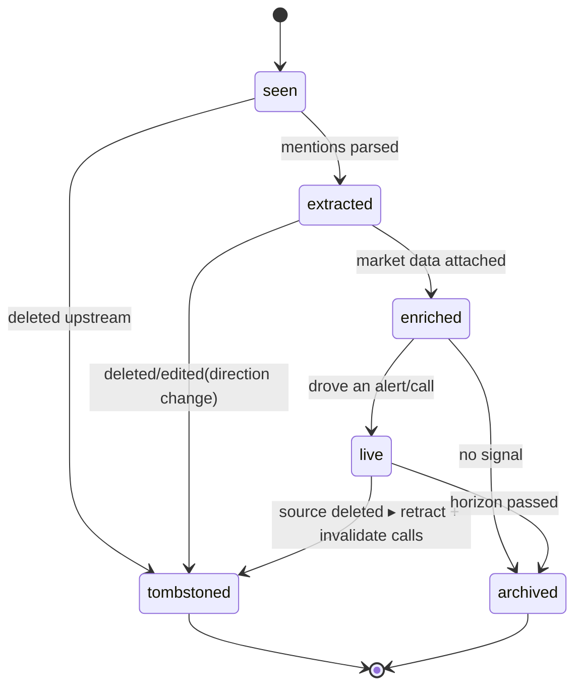
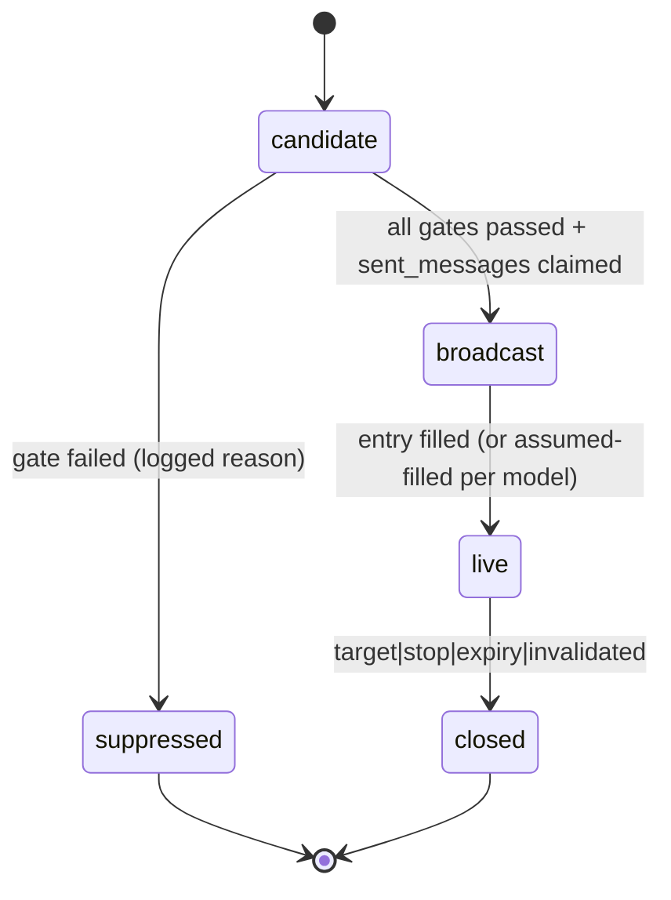
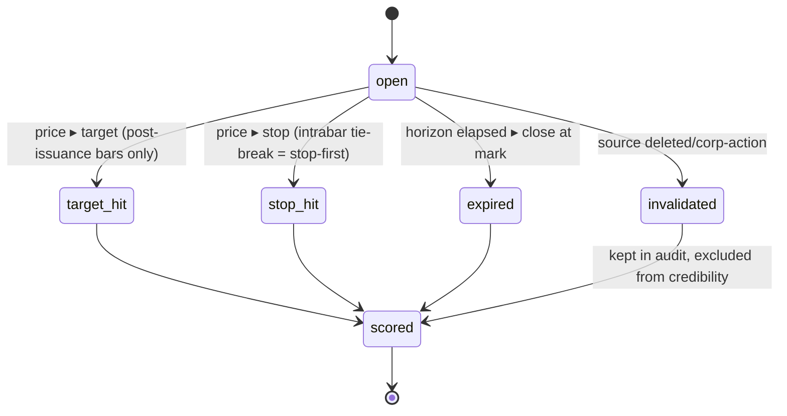

# ✨ Equities Narrative Tracker

> **Revision 2 (2026-06-03) — hardened after technical review.** Four reviewers (Simplicity, DHH, Kieran-Python, Architecture) critiqued v1. The user elected to **keep the aggressive posture** (auto-broadcast, all three assets, live day-one) and apply **all correctness fixes**. This revision adds: **Postgres-as-authority** for killswitch/budget/idempotent claims; the credibility **closure-time invariant**; **point-in-time reproducibility for every recommendation input**; two new anti-hallucination gates (**Provenance** + **Numeric-sanity**); a **fail-closed gate runner**; a properly-scoped (tested, path-dependent) **outcome scorer**; ingest **process isolation**; and five new entities (`market_bars`, `gate_evaluations`, `narrative_snapshots`, `budget_ledger`, `provider_events`). See **Core Invariants** below and the **Hardening Changelog** at the end. The dissenting reviewer view — ship alerts+digest only and defer graded calls to v2 — is recorded in the changelog for the record.

## Overview

An always-on system that turns a curated set of **X/Twitter accounts** into **auditable, explicit trade calls** delivered through **Telegram**, and that **grades its own calls over time** so signal quality compounds. It watches accounts in real time (push, ~1s), detects ticker mentions across **equities + options + crypto**, clusters them into market **narratives**, runs **TA/FA**, and **auto-broadcasts** explicit buy/sell calls (entry/stop/target) on the best 3 — behind mandatory deterministic safety gates — then scores every call against reality and **re-weights each account by historical accuracy**.

This plan is the **HOW** for the decisions captured in the brainstorm (see brainstorm: `docs/brainstorms/2026-06-03-equities-narrative-tracker-brainstorm.md`). It is grounded in five parallel research passes (X data, market data, Python stack, ops/hosting, and a spec-flow gap analysis) completed 2026-06-03; vendor facts and library versions below are current to that date.

> **Note on AI tooling:** Initial exploration, vendor research, and the spec-flow gap analysis were performed with Claude (compound-engineering agents). Code generated during implementation must be human-reviewed, and the safety-critical paths (broadcast gating, idempotency, outcome scoring) require tests before they go live.

---

## Enhancement Summary

**Deepened:** 2026-06-03 · **Sections enhanced:** 6 (parallel research agents) · **New companion detail:** see *Implementation Detail (Deepened)* below.

### Key improvements
1. **Narrative clustering** — resolved to *anchor-narratives + per-tick embedding assignment* (not re-cluster-from-scratch), with a dual-EWMA momentum model and stability rules that keep labels from churning.
2. **Credibility/attribution math** — concrete empirical-Bayes estimator (shrinkage expectancy + Beta-Binomial reliability gate + Lo Sharpe lower bound), exponential time-decay, and *signed-alignment* attribution so contrarians are scored correctly.
3. **Outcome scorer** — full path-dependent algorithm, reference implementation, 10 golden fixtures with exact expected R, and the as-of-issuance unadjusted-bars + adjustment-ledger storage design.
4. **Extraction cascade** — staged regex→NER→LLM→vision pipeline, two-confidence schema, common-word collision list, options-shorthand parser, and LLM-based stance/negation/sarcasm (not FinBERT).
5. **Social analytics** — credibility-weighted EWMA sentiment with N_eff guard; contrarian detection gated on *price disagreement* not level; multi-feature coordinated-pump detector.
6. **Telegram UX** — MarkdownV2 escaping discipline, all four message templates, admin command spec with nonce-confirm, token-bucket rate limiting, and alert coalescing.

### New considerations discovered
- **Decay half-life should track your chosen horizon:** you picked *Longer/position*, so credibility time-decay uses **H≈180d** (not the 90d swing default).
- **N_eff (effective sample size) guards everywhere** — one loud account shouldn't read as consensus in sentiment *or* narrative heat.
- **Embedding model:** OpenAI `text-embedding-3-small` (768-d truncated), embedding an *instrument-context doc*, not raw tweets.
- **`pandas-market-calendars`** is a hard dependency for both the session gate and the equities scorer horizon math.

---

## Problem Statement / Motivation

Narrative-driven trading happens on X faster than any human can watch. The user (and a small Telegram group) want to (1) never miss when trusted accounts post a ticker, (2) understand which **narratives** are actually hot, and (3) receive **specific, actionable** momentum/asymmetric trade ideas for the week — with a track record that proves whether the calls work.

**The hard parts (and why naive builds fail):**
- **Latency vs cost:** "<60s" sounds like it forces expensive aggressive polling. (Resolved — see Key Decision D1.)
- **Extraction is deceptively hard:** cashtags are easy; sarcasm, company-name references, chart-image-only posts, and common-word tickers (`$ALL`, `$ON`, `$IT`) are not.
- **Auto-broadcasting real-money calls with no human gate** means every edge case is a capital/reputation event, not a cosmetic bug. The spec-flow analysis found the original design has **no explicit state machines** and **fails open by omission** — the single most important thing this plan fixes.
- **The compounding moat** (account credibility from realized outcomes) only works if scoring is **point-in-time correct and look-ahead-safe**.

---

## Proposed Solution

A **Python modular monolith + always-on async worker** (see brainstorm decision: Architecture) implementing a 7-stage pipeline with **three explicit state machines**, **end-to-end idempotency**, and a **fail-safe default** (suppress money calls under any uncertainty).

```
            ┌──────────────── Always-on Worker (asyncio) ─────────────────┐
 X push ───▶│ 1 INGEST   push stream + list-poll fallback, dedupe, tombstone│
 (websocket)│ 2 EXTRACT  cashtag▸NER▸LLM disambig▸vision/OCR; stance+negation│──▶ Postgres (system of record + audit)
            │ 3 ENRICH   price/vol/liquidity/IV/funding/catalysts          │◀── Redis (dedupe, rate-limit, budget, killswitch)
            │ 4 ANALYZE  narrative clustering, sentiment, credibility-weight│◀── LiteLLM proxy (hard $ cap) ▸ LLMs/vision
            │ 5 RECOMMEND rank ▸ gates ▸ best-3 (entry/stop/target)         │
            │ 6 NOTIFY   Telegram: alerts + cadence digests (idempotent)    │──▶ Telegram (trading channel + ops channel)
            │ 7 SCORE    point-in-time outcomes ▸ account credibility       │
            └──────────────────────────────────────────────────────────────┘
   FastAPI sidecar: /health, /admin (authn'd source mgmt), kill-switch, audit read
   arq: offloads heavy jobs (vision calls, multi-bar scoring, enrichment fan-out)
```

**Key reframes from research:**
- **Push, not poll.** twitterapi.io Stream API delivers each post over WebSocket/webhook in ~1s (P99 <2s), trivially satisfying <60s. Polling exists only as a cheap fallback feed.
- **Fail-safe gates, not a human gate.** The user chose auto-broadcast with no human approval. We honor that, but every call must clear **deterministic** pre-broadcast gates (confidence, tradeability, staleness, session, correlation, coordinated-pump, budget, audit-writable). Any gate failing → suppress + log, never broadcast.
- **Analysis, not data dumps.** Vendor ToS forbids reposting raw market data; the broadcast path emits *derived* commentary + a TradingView deep-link, never vendor tables.

---

## Technical Approach

### Architecture & Stack Decisions (with rationale + cost)

| # | Decision | Choice | Rationale (research-backed) |
|---|---|---|---|
| **D1** | X data feed | **twitterapi.io Stream API** (primary, push ~1s, 99.9% SLA, ~$149–239/mo for 50–80 accts) → **SocialData** webhook fallback → **Bright Data** break-glass | Push solves <60s without polling cost. Diversify vendors across stacks so one X-side change can't kill all feeds. Fallback uses **list-based** polling (~$39/mo, ~50× cheaper than per-account). |
| **D2** | Equities + options data | **Polygon.io ("Massive")** Stocks Developer $79 + Options Developer $79 | Only sub-$100 vendor bundling **greeks + IV + OI** with the chain; unlimited calls; NBBO spread for liquidity filters. Cheap tiers are 15-min delayed (fine for IV-rank/earnings logic). |
| **D3** | Options IV rank / earnings-adjusted IV | **ORATS Delayed $199** *(optional)* — else compute IV-rank from Polygon history | ORATS ships IV rank/percentile + **earnings-adjusted IV** (the "don't buy crushed-high premium into earnings" guardrail). Cut this first to hit budget. |
| **D4** | Fundamentals + calendars | **FMP Premium $59** | 30-yr statements, ratios, DCF, and **earnings + economic + FOMC calendars** in one sub. |
| **D5** | Crypto | **CoinGecko Analyst $129** + **Coinalyze (free)** + Binance/Coinbase (free) + **Messari** token-unlocks | Spot + on-chain DEX liquidity (CoinGecko), funding/OI (Coinalyze), unlocks (Messari). |
| **D6** | FDA/PDUFA catalysts | Scrape **FDA Tracker / BioPharmaWatch** | No clean affordable API exists; treat as a known gap (manual/scrape). |
| **D7** | Technical analysis | **`pandas-ta-classic` 0.6.20** (+ optional **TA-Lib 0.6.8** wheels) | ⚠️ The original `pandas-ta` is **dead/unsafe** (repo removed, PyPI wiped). `pandas-ta-classic` is the live fork. TA-Lib now ships official wheels — no compiler. S/R is DIY (swing pivots). |
| **D8** | Outcome scoring | **Custom, tested, path-dependent scorer module** (not a framework) | Right call to hand-roll (backtrader=dead, vectorbt=Commons-Clause + wrong tool). ⚠️ **Not "~50 lines vectorized"** — gap-through-stop, same-bar stop+target, splits/dividends are *path-dependent*; implement as an explicit per-trade bar loop (numba ok), with a **golden-fixture test suite**. Score off **as-of-issuance unadjusted bars + an adjustment ledger**, never re-pulled adjusted closes (back-door look-ahead). |
| **D9** | Telegram | **`aiogram` 3.28.2** | Routers + magic filters for admin gating, `InlineKeyboardBuilder`/`CallbackQuery` for controls, first-class FSM for multi-step admin dialogs. |
| **D10** | Async worker | **Own asyncio tier-loops** + **`arq`** for heavy jobs | One task per cadence tier (HOT/WARM/COLD), full-jitter backoff, `wait_for(stop.wait())` graceful drain. Not Celery (wrong shape), not per-source APScheduler (won't scale). |
| **D11** | Redis | **`redis-py` `redis.asyncio`** + Lua — **cache/fast-path only** | ⚠️ **Postgres is the authority** for killswitch, budget, and every irreversible claim; Redis is an optimization. `r.lock()` reduces contention but is *not* a fencing lock — no money-call side-effect may depend on it for correctness. **Redis-unavailable ⇒ fail-closed** (killswitch reads as "engaged", budget reads as "exhausted"). |
| **D12** | Chart-image extraction | **Multimodal LLM** (Gemini 3.x Pro default; Claude Opus 4.x in-context) | Need *judgment* (which ticker, bullish/bearish), not transcription. Downscale to ~1024px; gate on budget; low-confidence → park, don't act. |
| **D13** | Structured extraction | **Provider-native structured outputs + `instructor` 1.15.1** | Native modes guarantee JSON *shape*; instructor adds typed Pydantic validation + **auto-retry/disambiguation** on failure. |
| **D14** | Compute host | **Railway** (lowest-ops, ~$15–30/mo) *or* **Hetzner CX33 + Coolify** (~$8/mo, cheapest stable) | ⚠️ **Avoid single-node Fly.io** — its own docs say a lone Machine isn't HA. Vercel only for a *future* TS dashboard (cron floors at 1-min; can't host the poller). |
| **D15** | Postgres + Redis hosting | **Neon Launch** or **Supabase Pro** + **Upstash** | Note: Neon scale-to-zero won't trigger for an always-connected worker — budget as active compute. Upstash per-command pricing fits a low-QPS poller. |
| **D16** | LLM cost cap | **LiteLLM proxy** `max_budget`/`budget_duration` (**budget authority**) | Hard cap at the **gateway** the worker can't bypass; the gateway's reported spend is the true ledger (Redis is only a pre-check). App **must fail-closed** on the proxy's 429/budget response *and* on proxy-down (treat both as "no LLM ⇒ degrade to cashtag-only, suppress calls"). |
| **D17** | Observability | **Healthchecks.io** (dead-man's switch) + **Sentry** (free) | Heartbeat the **ingest** (row written), not the loop iteration — catches the silent-empty-feed failure. |
| **D18** | Secrets | **Doppler** (Railway) or **Infisical** (Hetzner) | One source of truth synced into the host; never commit `.env`; least-privilege per key. |

### Data Model (ERD)

```mermaid
erDiagram
    accounts ||--o{ posts : authors
    accounts ||--o{ account_scores : "scored over time"
    posts ||--o{ post_versions : "edit history"
    posts ||--o{ ticker_mentions : yields
    instruments ||--o{ ticker_mentions : resolves_to
    instruments ||--o{ market_snapshots : "snapshotted"
    narratives ||--o{ narrative_members : groups
    instruments ||--o{ narrative_members : member_of
    narratives ||--o{ recommendations : "triggers (as-of window)"
    instruments ||--o{ recommendations : about
    recommendations ||--|| outcomes : scored_by
    recommendations ||--o{ sent_messages : broadcast_as
    recommendations ||--o{ gate_evaluations : "audited by"
    accounts ||--o{ recommendation_sources : contributes
    recommendations ||--o{ recommendation_sources : credited_to
    ticker_mentions ||--o{ recommendation_sources : evidence
    instruments ||--o{ market_bars : "OHLC series"
    narratives ||--o{ narrative_snapshots : "point-in-time"
    posts ||--o{ provider_events : "seen via"

    accounts {
        bigint id PK
        string platform_user_id "stable numeric ID, NOT handle"
        string handle
        string tier "HOT|WARM|COLD"
        float credibility_score "current, decayed"
        string asset_specialty
        bool active
        timestamptz added_at
    }
    posts {
        bigint id PK
        bigint account_id FK
        string platform_post_id "dedupe key w/ account_id"
        string post_type "original|retweet|quote|reply"
        bigint thread_root_id "nullable, thread reconstruction"
        text text
        jsonb media_urls
        string state "seen|extracted|enriched|live|archived|tombstoned"
        timestamptz posted_at
        timestamptz ingested_at
        timestamptz deleted_at "tombstone"
    }
    post_versions {
        bigint id PK
        bigint post_id FK
        int version_no
        text text
        timestamptz captured_at
    }
    ticker_mentions {
        bigint id PK
        bigint post_id FK
        string symbol
        string asset_class "equity|option|crypto"
        string resolution_method "cashtag|ner|llm|vision_ocr"
        string stance "bullish|bearish|neutral|unclear"
        bool negation_flag
        float mention_confidence
        float stance_confidence
        jsonb option_detail "strike/expiry/right, nullable"
    }
    instruments {
        bigint id PK
        string symbol
        string asset_class
        string canonical_name
        string exchange
        string liquidity_tier
        bool tradeable
        bool halted
    }
    narratives {
        bigint id PK
        string label
        vector embedding
        string momentum_state "rising|peaking|fading"
        timestamptz created_at
    }
    narrative_members {
        bigint narrative_id FK
        bigint instrument_id FK
        float weight
        timestamptz as_of
    }
    market_snapshots {
        bigint id PK
        bigint instrument_id FK
        timestamptz as_of
        numeric price
        numeric volume
        numeric iv_rank
        numeric spread
        jsonb extra "float, OI, funding, catalysts"
    }
    recommendations {
        bigint id PK
        bigint instrument_id FK
        string direction "long|short"
        numeric entry
        numeric stop
        jsonb targets
        numeric size_hint
        float confidence
        float credibility_at_issuance "point-in-time snapshot"
        string horizon
        string state "candidate|suppressed|broadcast|live|closed"
        string suppress_reason
        timestamptz issued_at
    }
    outcomes {
        bigint recommendation_id FK
        string close_reason "target|stop|expiry|invalidated"
        numeric realized_r
        numeric mfe_r
        numeric mae_r
        numeric benchmark_r "vs SPY/BTC"
        timestamptz closed_at
    }
    account_scores {
        bigint account_id FK
        timestamptz as_of
        float accuracy
        int sample_size
        float decayed_score
    }
    recommendation_sources {
        bigint recommendation_id FK
        bigint account_id FK
        float attribution_weight
    }
    sent_messages {
        bigint id PK
        string idempotency_key UK "deterministic from source event"
        bigint chat_id
        bigint telegram_message_id
        bigint recommendation_id FK
        timestamptz sent_at
    }
    audit_log {
        bigint id PK
        string event_type
        jsonb payload
        timestamptz created_at "append-only"
    }
    market_bars {
        bigint id PK
        bigint instrument_id FK
        timestamptz bar_ts
        string interval "1m|5m|1d"
        numeric open
        numeric high
        numeric low
        numeric close
        numeric volume
        bool adjusted "false = as-of-issuance raw"
    }
    gate_evaluations {
        bigint id PK
        bigint recommendation_id FK
        string gate_name
        bool passed
        jsonb measured_values
        timestamptz evaluated_at "append-only"
    }
    narrative_snapshots {
        bigint id PK
        bigint narrative_id FK
        timestamptz as_of
        string momentum_state
        jsonb members "symbols + weights at as_of"
    }
    budget_ledger {
        bigint id PK
        string bucket "llm|x_api|market_data"
        numeric amount
        string ref "idempotent charge key (UK)"
        timestamptz charged_at
    }
    provider_events {
        bigint id PK
        bigint post_id FK "nullable until matched"
        string provider "twitterapi|socialdata|brightdata"
        string provider_post_id
        timestamptz seen_at
        jsonb raw "envelope for cross-provider reconciliation"
    }
```



### The Three State Machines (the spec-flow backbone)

> The spec-flow analysis found ~80% of edge cases collapse out of three decisions: **define these state machines, make every side-effect idempotent, default to fail-safe.**

**Post lifecycle**


**Recommendation lifecycle**


**Outcome lifecycle**


### Pre-Broadcast Gate Chain (deterministic, fail-closed)

The LLM is an **untrusted proposer**: every field of a candidate call is re-derived or re-checked against system-of-record data before broadcast. A candidate broadcasts **only if every gate explicitly returned `pass`**. **Any gate that errors, times out, or returns no verdict ⇒ suppress** — the *gate runner itself* is fail-closed, not just the gate verdicts. Every evaluation (pass/fail + measured values) is written to `gate_evaluations` for forensics and threshold calibration. Gates are a **registry of independent predicates** `(candidate, context) → {pass|fail, measured}` run by a chain runner — so they can be reordered, tuned, and unit-tested in isolation.

1. **Confidence gate** — `mention_confidence ≥ θ_call` AND `stance_confidence ≥ φ_call` AND `stance ∈ {bullish,bearish}`.
2. **Stance/negation gate** — `negation_flag = false` (blocks "$X is NOT a buy" inversions).
3. **Provenance gate** 🆕 — the call's `symbol` MUST be one of the `ticker_mentions` extracted from the source post AND resolve to a real `instruments` row. The model selects from a constrained candidate set; an out-of-set symbol is rejected. *(Primary anti-hallucination control — `instructor` only guarantees JSON shape, not that the ticker is real.)*
4. **Numeric-sanity gate** 🆕 — `entry/stop/target` reconciled to the live `market_snapshot`: entry within `X%` of last price; `long ⇒ stop < entry < target` (inverted for short); stop/target within plausible ATR multiples. An entry far from market = stale read or hallucination ⇒ suppress.
5. **Tradeability gate** — not halted/LULD-paused, `price ≥ Pmin`, `ADV ≥ Vmin`, `spread ≤ Smax`, optionable if an options call.
6. **Staleness gate** — driving `market_snapshot` age `≤ D`. ⚠️ `D` cannot be tighter than the feed's own latency (Polygon cheap tiers are 15-min delayed → equity entries are *indicative*, and the broadcast must say so).
7. **Session gate** — equity/option calls outside RTH are **queued and re-validated at next open** (re-pull price); uses a real market calendar (`pandas-market-calendars`) for holidays/half-days, not hand-rolled hours.
8. **Catalyst gate** — earnings/FDA/FOMC/unlock/OPEX within `H` hours → suppress or annotate with explicit catalyst-risk (per type).
9. **Conflict gate** — net credibility-weighted stance within `±ε` of neutral → suppress (accounts disagree).
10. **Coordinated-pump gate** — mention spike across `≥K` low-credibility accounts within `W` → suppress.
11. **Correlation/concentration gate** — ≤1 call per narrative cluster (or pairwise `ρ ≤ ρmax`); if <3 independent narratives qualify, broadcast fewer and say so.
12. **Stacking gate** — symbol already has a live call: same-direction → update (no dup post); opposite → explicit flip/close message.
13. **Budget gate** — LiteLLM (authority) + Redis pre-check not exhausted; **Redis-unreadable ⇒ treat as exhausted** (else degrade to alert-only, suppress calls).
14. **Audit gate** — Postgres writable AND killswitch (Postgres-authoritative) disengaged; no auditable record ⇒ no call.

### Core Invariants (the hardening backbone — settle before coding)

These six invariants are cheaper to enforce as data-model + contract decisions now than as bug fixes later. They are the heart of Revision 2.

**INV-1 — Postgres is the authority; Redis is a cache.** No irreversible side-effect (broadcast, outcome write, credibility update) may depend on Redis for correctness. The `sent_messages` claim is an **INSERT against a Postgres unique constraint *before* the Telegram call** (claim → send → record `telegram_message_id`); Redis is only a hot-path pre-check. **Killswitch and budget authority live in Postgres** (Redis caches them); **Redis-unreadable ⇒ fail-closed** (killswitch = engaged, budget = exhausted).

**INV-2 — Point-in-time reproducibility for *every* recommendation input.** Not just credibility — **narrative momentum, instrument flags (`halted`/`tradeable`), gate measurements, and prices** must all be reproducible as-of issuance. Mechanism: pin one `as_of = ingested_at` per pipeline run; read all state as-of that timestamp; **snapshot the load-bearing values onto the recommendation row** (and `gate_evaluations`); make narrative state and instrument flags **append-only** (`narrative_snapshots`, history rows) rather than mutated in place. A system that snapshots only credibility *looks* reproducible but silently isn't.

**INV-3 — Credibility closure-time invariant (the moat's correctness condition).** `credibility(account, as_of=T)` is a pure function of outcomes with **`closed_at ≤ T`** — not `issued_at ≤ T`. `account_scores` rows carry both `as_of` and the max `closed_at` they incorporate, so the property is checkable. Credibility is a **pure recomputation from the full closed-outcome set**, never an incremental delta (idempotent by construction). *Required regression test:* the 4-step scenario where an account's first call closes a win at T+14d and drives a second call at T+3d — the second call's `credibility_at_issuance` MUST be identical whether or not the first outcome exists yet.

**INV-4 — Idempotency at every side-effecting stage, atomic with state transition.** Each stage's `posts.state` advance commits **in the same transaction** as its durable output (no half-states). Per-stage keys:
- *Ingest:* `(account_id, platform_post_id)` unique; backfill + fallback-provider paths route through the same claim (cross-provider dedupe via `provider_events`).
- *Extract (non-deterministic LLM):* write-once keyed by `(post_id, model_version, prompt_version)`; a replay **reuses** the prior result, never re-infers.
- *Enrich:* `market_snapshots`/`market_bars` upsert on `(instrument_id, as_of/bar_ts, source)` unique — arq is at-least-once, so jobs must be idempotent on their output table; the vision cache check is **atomic with** its write.
- *Notify:* `sent_messages` per INV-1; the claim row is `pending` until `telegram_message_id` is recorded, with reconciliation for the crash-after-send window (needed for retractions).
- *Score:* outcome + credibility are pure recomputations (INV-3), safe to re-run.

**INV-5 — Outcome scoring is path-dependent and tested (not a one-liner).** Per-trade scoring is an explicit bar loop over **as-of-issuance unadjusted bars + an adjustment ledger** (re-pulling adjusted closes reintroduces look-ahead). Conventions: entry fills on the bar **after** the signal; single bar tagging both stop and target resolves **stop-first** (conservative) unless tick data proves otherwise; gap-through-stop fills at the open; horizon expiry closes at mark; delisted/halted/acquired names stay in the population (survivorship-safe); results benchmarked vs SPY/BTC. Golden-fixture tests required for each of: gap-through-stop, same-bar stop+target, split, dividend, expiry-at-mark, delisting.

**INV-6 — Concurrency, backpressure, and ingest isolation.** **Ingest runs as its own process/supervisor** (same codebase, separate lifecycle) so a stage crash or a deploy can't drop the WebSocket and lose posts; it also gets a **durable buffer** (Redis Stream or disk) so a Postgres outage suppresses calls (correct) without losing posts. Ingest only writes the row + enqueues; per-tier consumers read a **bounded queue**; on overflow, spill to a **Postgres-backed work table** (never block ingest, never drop). Each cadence tier has bounded worker concurrency so one slow tier can't starve others.

### Implementation Phases

#### Phase M0 — Pipeline spine (prove <60s end-to-end)
- twitterapi.io **WebSocket** ingest as its **own process** (INV-6) with a durable buffer; dedupe by `(account_id, platform_post_id)` — **Postgres unique constraint is authoritative**, Redis is the pre-check (INV-1).
- Cashtag-only extraction (`$AAPL`/`$BTC` regex) → `ticker_mentions`.
- Minimal Telegram alert to the **trading channel** via `aiogram`, with the `sent_messages` ledger: **Postgres claim → send → record `telegram_message_id`** (INV-1, INV-4).
- FastAPI `/health`; Healthchecks.io heartbeat on **row-written**.
- **Exit criteria:** a watched post produces a deduped, idempotent alert in <60s; worker restart never double-posts; ingest survives a stage crash.
- Mock files: `worker/ingest/stream_client.py`, `worker/ingest/buffer.py`, `worker/extract/cashtag.py`, `notify/telegram_bot.py`, `db/models.py`, `db/idempotency.py`.

#### Phase M1 — Full extraction (the signal-quality phase)
- NER + LLM disambiguation (instructor + native structured outputs); **stance + negation** as first-class fields with their own confidence.
- **Vision/OCR for chart-image posts** (Gemini 3.x Pro), budget-gated, dedup-cached by media-URL hash.
- Cross-asset symbology resolution → `instruments`; options syntax parsing (`$SPY 600c`, LEAPS); common-word ticker collision list.
- Thread reconstruction; retweet/quote/reply taxonomy; cross-provider dedupe; edit/delete handling (`edit_history_tweet_ids`, tombstones).
- **Exit criteria:** image-only and cashtag-less posts resolve correctly; "$X is NOT a buy" yields bearish/suppressed.
- Mock files: `extract/ner_llm.py`, `extract/vision.py`, `extract/stance.py`, `extract/symbology.py`, `ingest/dedupe.py`.

#### Phase M2 — Narrative + sentiment layer (the real product)
- Embedding-based clustering of mentions into **narratives**; momentum state (rising/peaking/fading) from mention velocity/acceleration.
- Per-ticker aggregate sentiment + **contrarian extreme** detection (euphoria = caution).
- Credibility-weighted mention tallies (uses `account_scores` as-of).
- **Exit criteria:** daily/3-day/weekly digest renders a ranked narrative map with momentum.
- Mock files: `analyze/narratives.py`, `analyze/sentiment.py`, `analyze/digest.py`.

#### Phase M3 — Deep-dive + explicit calls (the highest-stakes phase)
- Enrich top 5–10 tickers: price/vol/liquidity, **IV rank** (Polygon-computed or ORATS), catalysts, fundamentals.
- TA via `pandas-ta-classic` (RSI/MACD/Supertrend/OBV + DIY S/R); composite ranking.
- **14-gate registry + fail-closed runner** (includes 🆕 Provenance + Numeric-sanity); `pandas-market-calendars` for the session gate; every evaluation logged to `gate_evaluations`.
- Best-3 selection; explicit call object built from a **shared `targets` Pydantic schema** (reused by gates *and* scorer to prevent drift); LLM treated as **untrusted proposer** — provenance + numeric-sanity re-check every field against system-of-record data.
- **Exit criteria:** a call broadcasts only when *every* gate returns an explicit pass (any gate error/timeout ⇒ suppress); suppressed candidates persist full `gate_evaluations`; no raw vendor data in the message.
- Mock files: `enrich/market_data.py`, `analyze/technicals.py`, `recommend/ranker.py`, `recommend/gates/` (registry), `recommend/gate_runner.py`, `recommend/call_builder.py`, `schemas/targets.py`.

#### Phase M4 — Feedback loop (the compounding moat)
- Outcome scorer as a **tested, path-dependent bar-loop** (INV-5) over **as-of-issuance unadjusted `market_bars` + adjustment ledger**; R-multiple, MFE/MAE, **benchmark-relative** (SPY/BTC). Golden fixtures: gap-through-stop, same-bar stop+target, split, dividend, expiry-at-mark, delisting.
- "Closed" definition with **stop-first intrabar tie-break**, horizon/expiry, gap-fill, survivorship-safe population.
- Credibility as **pure recomputation from closed outcomes** honoring the **closure-time invariant** (INV-3) + its regression test; **multi-account attribution function** (credibility-weighted split) applied identically in scoring and ranking.
- Outcome + credibility dashboards (read via FastAPI; later TS dashboard on Vercel).
- **Exit criteria:** the closure-time regression test passes; re-running the scorer yields **identical** history (reproducible, look-ahead-free).
- Mock files: `score/outcome.py` (+ `score/fixtures/`), `score/attribution.py`, `score/credibility.py`, `score/benchmark.py`, `db/adjustments.py`.

#### Phase M5 — Hardening & degraded modes
- **Dependency × stage degraded-mode matrix** (fail-safe: suppress calls when audit/fresh-price/LLM unavailable).
- Budget-exhaustion behavior; **Redis-loss ⇒ fail-closed** (no re-alert storm; killswitch reads engaged); Postgres-loss (halt broadcast; the ingest buffer prevents post loss); Telegram retry/poison handling; recovery-replay through freshness + idempotency gates.
- Admin surface: authn'd `/admin` + aiogram commands (add/remove/filter source with **effect-time semantics**, cadence change, **two-mode pause**, **kill switch**), all audited.
- **Exit criteria:** each dependency can be killed in a drill and the system fails safe, then recovers without flooding.
- Mock files: `ops/degraded.py`, `ops/killswitch.py`, `admin/api.py`, `admin/commands.py`, `ops/recovery.py`.

---

## Alternative Approaches Considered

| Approach | Why rejected (vs chosen) |
|---|---|
| **Polling-first ingestion** | Per-account polling at <60s costs ~$1,166–3,110/mo in request minimums; push streaming is ~$149/mo and ~1s. Polling kept only as list-based fallback. |
| **Official X API** | Far more expensive at real-time tiers; third-party push covers the need within budget (see brainstorm decision: X data access). |
| **Event-driven microservices** | Over-engineered for "me + small group"; modular monolith + worker splits later (see brainstorm: Architecture). |
| **LLM-agent-orchestrated pipeline** | Non-deterministic latency/cost and harder to audit — unacceptable for auto-broadcast money calls. |
| **Backtest framework (vectorbt/backtrader) for scoring** | backtrader is dead; vectorbt OSS is Commons-Clause and overkill. A custom forward-labeling scorer is auditable and leak-resistant. |
| **Single-node Fly.io** | Fly's own docs: a lone Machine isn't HA. Railway/Hetzner preferred for a latency-sensitive always-on worker. |
| **Human approval gate before broadcast** | User explicitly chose auto-broadcast (see brainstorm: Broadcast gate). Replaced with deterministic fail-safe gates + circuit-breakers + kill switch. |

---

## System-Wide Impact

### Interaction Graph
A single inbound tweet triggers: **ingest** (dedupe claim in Redis → Postgres insert) → **extract** (LLM/vision calls, budget-charged via LiteLLM) → **enrich** (market-data fan-out via arq) → **analyze** (narrative re-cluster, sentiment, credibility lookup) → possibly **recommend** (gate chain → `sent_messages` claim → Telegram send) → later **score** (outcome job → `account_scores` update → changes future ranking weights). Two levels deep, an account's *credibility* is mutated by outcomes, which **feeds back** into which future tweets become calls — the core compounding loop and the main source of look-ahead risk.

### Error & Failure Propagation
Default posture is **fail-safe**: any uncertainty (stale price, LLM down/over-budget, Postgres unwritable, vendor disagreement beyond tolerance) **suppresses live calls** while optionally continuing degraded alerts with a visible banner. Provider 429/5xx → exponential backoff w/ full jitter. LLM cap enforced at the LiteLLM gateway (un-bypassable). Telegram 429 → backoff within the idempotency claim; permanent failure (bot blocked/removed) → escalate to **ops channel**, never silent-drop a call.

### State Lifecycle Risks
Idempotency is required at **every** side-effecting step, not just notify: dedupe claim (ingest), `sent_messages` claim-before-send (notify), outcome write, credibility update. Stable keys derive from the **source event** (`account_id + platform_post_id + signal_type`) — never `now()`/UUID, or a restart double-posts. Redis is the fast path; **Postgres unique constraints are the durable backstop** so a Redis flush can't cause a re-alert storm.

### API Surface Parity
Every control exists in **two planes**: aiogram admin commands *and* authn'd FastAPI `/admin`, sharing one service layer + one audit log. Kill switch and pause must behave identically from both.

### Integration Test Scenarios
1. Tweet arrives via **both** primary and fallback providers (different IDs) → exactly one alert.
2. Worker **restarts mid-digest** (1 of 3 calls sent) → no resend, clean resume/abort.
3. Source post **deleted after a live call** → retraction posted, call invalidated, outcome handled.
4. **LLM over budget** on the 25th → degrade to cashtag-only, calls auto-suppress, ops notified.
5. Equity call generated **at 3am** → queued, re-validated at open (price re-pulled), not stale-broadcast.

---

## Acceptance Criteria

### Functional
- [ ] A watched post yields a deduped, idempotent Telegram alert in **<60s** (push path).
- [ ] Extraction emits per mention: `symbol, asset_class, resolution_method, stance, negation_flag, mention_confidence, stance_confidence` (+ `option_detail` when applicable).
- [ ] Chart-**image-only** posts resolve a ticker + stance via vision, or are explicitly parked (never silently dropped).
- [ ] A mention drives a **live call** only if it clears the **entire** gate chain; suppressed calls persist a `suppress_reason`.
- [ ] Calls broadcast **derived analysis + TradingView link only** — no raw vendor data (ToS).
- [ ] Daily / 3-day / weekly digests render a credibility-weighted **narrative map** with momentum state.
- [ ] Every closed call is scored **point-in-time** (post-issuance bars only) with R / MFE / MAE / benchmark-relative return.
- [ ] Account credibility updates via the documented **attribution function** and changes future ranking.
- [ ] Admin can add/remove/filter sources, change cadence, pause (two modes), and **kill** — from Telegram and `/admin`, all audited.

### Non-Functional
- [ ] **Idempotency (INV-1, INV-4):** no double-post across restarts, provider overlap, or Telegram retries — **Postgres unique constraint is the authority**; every side-effecting stage is idempotent and commits atomically with its `posts.state` advance.
- [ ] **Point-in-time correctness (INV-2, INV-3):** *every* recommendation input (credibility, narrative momentum, instrument flags, prices, gate measurements) is reproducible as-of issuance; credibility honors the **closure-time invariant** and its regression test passes.
- [ ] **Fail-closed (INV-1):** with Postgres unwritable, price stale, LLM down/over-budget, **or Redis unreadable**, **zero live calls** are broadcast; the **gate runner suppresses on any gate error/timeout**, not just on a fail verdict.
- [ ] **Anti-hallucination:** the **Provenance** and **Numeric-sanity** gates reject any call whose symbol isn't in the source post's extracted mentions or whose levels don't reconcile to live price/ATR.
- [ ] **Cost cap:** LiteLLM hard budget cap is the **authority**; Redis ledger is a pre-check; spend cannot exceed configured ceilings.
- [ ] **Observability:** dead-man's switch fires to the **ops channel** within ~2 min of ingest stalling; Sentry captures worker + API exceptions.
- [ ] **Latency:** push ingest P99 < 2s; end-to-end alert P95 < 60s.
- [ ] **Compliance:** disclaimer injected on every broadcast call (enforced in the send path); **derived analysis only, never raw vendor data**.

### Quality Gates
- [ ] Tests for all safety-critical paths: gate **runner fail-closed** + each gate predicate in isolation; idempotency ledger (claim-before-send + crash-after-send reconciliation); outcome scorer **golden fixtures** (gap / stop+target / split / dividend / expiry / delisting); **closure-time regression test**; attribution.
- [ ] Degraded-mode drill passes for each dependency (X, market data, LLM, Telegram, Postgres, Redis) — each fails **closed**.
- [ ] Human review of all AI-generated safety-critical code.

---

## Success Metrics

- **Coverage:** % of watched-account ticker posts that produce a correct mention (target ≥95% for cashtags, ≥80% incl. image/name references).
- **Latency:** P95 alert <60s; push P99 <2s.
- **Call quality (the moat):** rolling **expectancy (avg R)** and **hit-rate vs benchmark**; trend should improve as credibility weighting matures.
- **Calibration:** predicted confidence vs realized win-rate (reliability curve).
- **Safety:** zero un-audited broadcasts; zero double-posts; zero calls on stale/halted instruments.
- **Cost:** all-in monthly spend within the chosen ceiling; LLM never exceeds cap.

---

## Dependencies & Prerequisites

- **Accounts/keys:** twitterapi.io (+ SocialData fallback), Polygon/Massive, FMP, CoinGecko, Coinalyze, Messari, an LLM provider via LiteLLM, Telegram bot token + two channels (trading + ops).
- **Infra:** Railway *or* Hetzner+Coolify; Neon/Supabase Postgres (pgvector for embeddings); Upstash Redis; Doppler/Infisical; Healthchecks.io; Sentry.
- **User inputs:** the seed X watchlist (user has it — see brainstorm: Seed accounts) with per-account tier (HOT/WARM/COLD); risk parameters (Pmin, Vmin, Smax, θ/φ confidence bars, K/W pump thresholds, ρmax, horizon per trade type, position-size model).
- **Validation TODO:** pull one **image-tweet** through twitterapi.io and SocialData to confirm `media_url_https` is present and fetchable (the one payload field not documented on their landing pages) — load-bearing for the vision pipeline.

---

## Risk Analysis & Mitigation

| Risk | Severity | Mitigation |
|---|---|---|
| **Auto-broadcast of a wrong/hallucinated/pump call** to people who act on it | 🔴 Critical | Full deterministic gate chain; LLM schema + sanity validation; coordinated-pump + low-confidence circuit-breakers; kill switch; immutable audit log; disclaimer on every call. |
| **Look-ahead leak corrupts credibility** | 🔴 Critical | Store credibility-at-issuance on the rec row; score only `bars[t+1:]`; reproduce from point-in-time snapshots; survivorship-safe population. |
| **Double-posting on restart / provider overlap** | 🟠 High | Deterministic idempotency keys; Redis claim-before-send + Postgres unique backstop. |
| **Third-party X feed silently dies** (ToS-gray, breaks w/o notice) | 🟠 High | Heartbeat on ingest; dead-man's switch; independent fallback vendor (different stack); break-glass tertiary; backfill via `since_id` through freshness gate. |
| **Cost runaway** (vision LLM + data minimums) | 🟠 High | LiteLLM hard cap at gateway; Redis data-budget ledger + breaker; tiered polling; model-tier routing; downscale images; dedup-cache vision. |
| **Vendor ToS / redistribution violation** | 🟠 High | Broadcast derived analysis only, never raw vendor data; keep group non-commercial; revisit if monetized (Twelve Data/Tiingo have paid redistribution paths). |
| **"Investment advice" / liability** (group acts on calls) | 🟠 High | Disclaimer enforced in send path; audit log; **recommend a professional legal/compliance check before scaling the group** — this plan does not constitute legal/financial advice. |
| **Single-host outage** (latency-sensitive worker) | 🟡 Med | Avoid single-node Fly; systemd/`restart:unless-stopped`; healthcheck crash-loop detection. |
| **FDA/PDUFA data gap** | 🟡 Med | Accept scrape/manual entry; annotate biotech calls with catalyst-uncertainty. |

---

## Cost Estimate (monthly) — corrected to include the X data feed

> ⚠️ **Correction:** Revision 1's table omitted the X data feed itself. Including it, the **Recommended all-in is ~$885/mo**, not $685. You selected Recommended ("whatever it takes"), so this is in-bounds — but the honest number is ~$885.

| Profile | X feed | Data vendors | Infra (excl. LLM) | LLM (cap) | **All-in** |
|---|---|---|---|---|---|
| **Lean** — Polygon Options Starter $29 + Stocks Dev $79 + FMP $59 + CoinGecko $129; IV in-house; list-poll X | ~$39 | ~$296 | ~$25 (Hetzner+Upstash+Neon) | ~$50 | **~$410** |
| **✅ Recommended (selected)** — Polygon Stocks Dev $79 + Options Dev $79 + **ORATS $199** + FMP $59 + CoinGecko $129; twitterapi.io stream $149 + SocialData fallback ~$30 | ~$179 | ~$545 | ~$60 (Railway+Supabase+Upstash) | ~$100 | **~$885** |

**To trim later without losing much:** drop the SocialData fallback (−$30) until the primary feed proves flaky; drop **ORATS** (−$199) and compute IV-rank from Polygon once you have a few weeks of history → **~$655/mo**.

---

## Resolved Parameters (v1 starting config — 2026-06-03)

All Open Decisions are resolved. Scope posture = **keep auto-broadcast, all three assets, live day-one — with full Revision-2 hardening**; intrabar tie-break = **stop-first**. The values below ship as config defaults and are tunable against real data.

> ⚖️ **Noted tension:** a **Conservative** gate posture (Pmin $5, ADV $10M, microcaps/thin tokens excluded) will filter out many of the small-cap / low-cap-token *asymmetric* plays you mentioned wanting. That's the safe default under auto-broadcast; loosen specific knobs (e.g. crypto `min_24h_volume`, `Pmin`) later once the track record justifies it.

**Risk gates — Conservative preset** (`config/risk.yaml`)

| Param | Equities / Options | Crypto |
|---|---|---|
| Min price `Pmin` | $5.00 | n/a |
| Min liquidity `Vmin` | $10M 20-day avg $-volume | $50M 24h volume |
| Max spread `Smax` | 0.5% | (via liquidity) |
| Min market cap | $500M | $1B |
| Min DEX pool liquidity | — | $1M |
| Options-only | OI ≥ 500, option spread ≤ 5% | — |
| Staleness `D` | 900s (15-min feed floor) | 60s |

Shared: mention-confidence `θ_call` **0.75**, stance-confidence `φ_call` **0.70**, numeric-sanity band **±5%**, conflict neutral band `ε` **0.15**, coordinated-pump **K 3 accts / W 30 min**, correlation cap `ρmax` **0.60** (≤1 call per narrative cluster), catalyst window `H` **24h**.

**Position sizing** (`config/sizing.yaml`): `fixed_fractional`, **1.0% risk per trade** (size derived from entry→stop distance), **portfolio heat cap 6.0%**, **max 6 concurrent calls**; calls beyond the cap are suppressed and logged.

**Horizons — Longer/position** (`config/horizons.yaml`): intraday/0DTE → close same session; **swing → 1–3 weeks (5–15 trading days)**; **position → 1–3 months (21–63 trading days)**; horizon expiry → close at mark + score.

**Budget — Recommended profile** (`config/budget.yaml`): all-in **~$885/mo** (corrected table above), **LLM hard cap $100** (LiteLLM is the authority), **ORATS enabled** (earnings-adjusted IV).

---

## Implementation Detail (Deepened 2026-06-03)

Concrete, implementation-ready depth for the six algorithmically-hard subsystems. Each maps to its milestone. **Full specs** (complete reference code, schemas, templates, golden fixtures) live in companion docs:

- [`docs/design/01-narrative-clustering.md`](../design/01-narrative-clustering.md) (M2)
- [`docs/design/02-credibility-attribution.md`](../design/02-credibility-attribution.md) (M4)
- [`docs/design/03-outcome-scorer.md`](../design/03-outcome-scorer.md) (M4)
- [`docs/design/04-extraction-cascade.md`](../design/04-extraction-cascade.md) (M1)
- [`docs/design/05-social-analytics.md`](../design/05-social-analytics.md) (M2)
- [`docs/design/06-telegram-ux.md`](../design/06-telegram-ux.md) (M0/M5)

### A. Narrative clustering (M2) — `analyze/narratives.py`, `analyze/discovery.py`

**Architecture: anchor narratives + per-tick assignment** (do *not* re-cluster from scratch — at dozens of tickers/day the hard problem is label *stability*, not finding groups).
- **Hot path (every tick + 15-min heartbeat):** embed each active instrument's *context doc* (`text-embedding-3-small`, 768-d), cosine-assign to the nearest existing anchor if `≥ T_assign`; else mark `UNASSIGNED`. Deterministic → reproducible (INV-2).
- **Cold path (nightly):** HDBSCAN over active+unassigned → **one temp-0, schema-pinned LLM call** to name new clusters and propose merges/splits. The LLM touches *only identity*, persisted as data, so replay never re-invokes it.
- **Momentum:** dual-EWMA heat (fast 6h / slow 24h) → `ν = (fast−slow)/slow`; accel EWMA (3h); **robust MAD z-score gate `z≥2.0`** (noise floor); optional price confirmation; state machine RISING/PEAKING/FADING/DORMANT with **2-bucket dwell**. Heartbeat lets quiet narratives decay to fading.
- **Heat is credibility-weighted** with empirical-Bayes shrinkage (`k=10`) + tier priors (HOT .6 / WARM .35 / COLD .15); coordinated bursts capped via the pump signal.

| Param | Value | | Param | Value |
|---|---|---|---|---|
| `T_assign` / `T_ambiguous` | 0.62 / 0.50 | | hysteresis `δ` / switch `m` | 0.05 / 0.04 |
| spawn: min instruments / persistence | 3 / 2 runs | | `T_merge` / `T_split` | 0.80 / 0.35 |
| anchor EWMA `α` (nightly) | 0.15 | | momentum `ν_hi`/`ν_lo`/`z_min` | 0.20 / 0.05 / 2.0 |

*Calibration task before go-live: hand-label one trading day, grid-search the cosine/momentum thresholds (they shift with embedding model + context-doc format).*

### B. Credibility & attribution (M4) — `score/credibility.py`, `score/attribution.py`

**Estimator = shrinkage expectancy × Beta-Binomial reliability gate × magnitude-aware lower bound** (no single method suffices; win-rate ≠ profitability):
```
p̂_a   = (α₀ + Σ w·hit)/(α₀+β₀+Σ w)         # EB Beta win-rate, K=α₀+β₀ clamped [20,60]
Ê_a   = E₀ + (n/(n+k_E))·(E_a − E₀)         # James-Stein shrinkage expectancy, k_E=10
Êlo_a = (SR_a − z·SE(SR))·sd(R⊥)            # Lo Sharpe SE w/ skew+kurtosis, z=1.0
Cred_a = p̂_a^θ · max(Êlo_a,0) · n/(n+m) + floor      # θ=0.7, m=5
```
- **Time decay** `w = 2^(−Δ/H)`; **H = 180d** (your position horizon). Keep undecayed `n_raw ≥ 8` gate.
- **Attribution (signed alignment):** `raw_i = Cred_i · conf_i · 2^(−Δmention/Hₐ) · align`, `align=+1` agree / `−η` oppose (η=1). Normalize within agreers vs opposers separately; an opposed account is scored on the **inverse** outcome → the system *learns from contrarians*.
- **Pump damping is asymmetric:** multiply positive attributed R by `trust=1−coord`, **never damp losses** → manufacturing a burst to farm credibility is −EV.
- **Benchmark-relative:** everything operates on `R⊥ = R − β·bench_R` (signed by direction) so a win in a ripping market isn't over-credited.
- **Pure recomputation** over `{closed_at ≤ T}` (INV-3); auto-close stale calls at horizon so ghosting a loser still realizes it.

### C. Outcome scorer (M4) — `scorer/core.py`, `db/adjustments.py`, `score/fixtures/`

**Explicit per-trade bar loop** (path-dependent; volume is tiny so readability > vectorization). Per bar, in order: apply due split (rescale plan once) → terminal event → update MFE/MAE → **gap-through-stop fills at the open** → gap-through-target at open → intrabar-both → sub-bars else **stop-first** → stop → target → invalidation; else **expiry mark-out** at horizon close. Fifth close reason **`terminal`** (delist/M&A) — never bucketed as `stop`.
- **Storage:** immutable **as-of-issuance unadjusted `market_bars`** + a separate **`adjustments` ledger** replayed forward. Never re-pull adjusted closes (back-door look-ahead). Polygon: `adjusted=false` + corporate-actions endpoint.
- **Golden fixtures (exact expected R):** gap-through-stop **−1.6R**, same-bar stop+target (no sub-bars) **−1.0**, 2-for-1 split-invariance **+3.0**, $2 dividend **+2.4**, expiry-at-mark **+0.4**, delist-to-zero **−20.0**, short favorable-gap **+2.8**, M&A cash-out **+1.8**, no-look-ahead guard, never-hit. Plus a `hypothesis` property test (`mae_R ≤ realized_R ≤ mfe_R` for mark-outs; monotone-up long never ends `stop`).
- **Crypto vs equities** behind a `MarketCalendar`: equities horizon = session-count (skip weekends/holidays via `pandas-market-calendars`), LULD halts non-tradeable; crypto = wall-clock, pin a reference venue.

### D. Extraction cascade (M1) — `extract/*`

**Two orthogonal confidences** (`mention_confidence` ≠ `stance_confidence`) — an inverted stance is a wrong trade even when the symbol is certain. Staged cheap→expensive:
- **S1 regex:** cashtags + **$-amount filter** (`$4200` ≠ ticker) + **options-shorthand parser** (`$SPY 600c 0DTE`, `Jan'27 LEAPS` → `OptionDetail`, keep `expiry_raw`) + **common-word collision gate** (`$ALL $ON $IT $SO $ARE $BE $ANY $NOW $REAL $AI $YOLO …` → versioned YAML, require finance context).
- **S2 NER + entity-link:** **GLiNER2** (CPU, ~205M, ~2.6× faster than GPT-4o) → alias table from **SEC EDGAR + Nasdaq/NYSE + Wikidata** ("Ozempic maker"→NVO via Wikidata edge, with provenance).
- **S3 LLM disambiguation + stance:** `instructor` + Pydantic + provider-native structured outputs; **stance via instruction-rich LLM, not FinBERT** (FinBERT fails on slang/sarcasm); explicit negation scope + sarcasm inversion (lower confidence) + force `neutral`/`unclear` on questions; **cross-asset policy** (`$ETH`=crypto default, `$MSTR`=equity with BTC-proxy as a tag).
- **S4 vision** (image posts only) → same schema. **S5 calibration:** self-consistency (k-sample) + verbalized + logprobs → temperature/isotonic, monitor ECE so the θ/φ gates mean what they say.
- Every LLM-emitted symbol validated against the alias table (Provenance gate); unknown → rejected.

### E. Social analytics (M2) — `analyze/sentiment.py`

Shared per-symbol **event-time EWMA** (irregular spacing via `exp(−λΔ)`), O(1) incremental.
- **Sentiment:** `S = Σ w·stance/(Σw+k)`, `w = cred^γ·stance_conf·decay`; `γ=1.5`, `k=2`, half-life 6–12h. **Always emit `Conf` and `N_eff` (Kish); require `N_eff ≥ 5`** so one account ≠ consensus.
- **Contrarian = extremity vs own history + price disagreement, NOT level.** Modified MAD z (`|z|≥3.0–3.5`) + percentile gate (`≥0.95`) + velocity (blow-off). **Fire only on the turn** (rolling-over or RSI/momentum divergence), with cooldown — euphoria can persist.
- **Coordinated-pump detector (multi-feature, refines the K/W gate):** Poisson burst-surprise (hard gate `z≥4`) × low-credibility fraction × new-account fraction × content-dup (simhash) × timing synchronization × **co-mention cluster recurrence (strongest)** × known-pumper watchlist × target illiquidity → weighted-logistic score (flag 0.70 / act 0.85), graduate to a trained classifier with labels. Feed back as a `(1−PumpScore)` downweight on sentiment. Discriminator: real news = credible accounts + diverse + varied content; pump = bottom-heavy + recurring cluster + copypasta.

### F. Telegram UX (M0/M5) — `notify/*`, `admin/*`

- **MarkdownV2 discipline:** 18 reserved chars; escape at the boundary via coercing `md()/md_code()/md_url()`; **render tickers in code-spans** (`` `$BRK.B` `` is parse-safe); **`safe_send` plain-text fallback so a parse bug never drops a call.**
- **Templates:** ALERT, **DIGEST** (derived analysis only per ToS + safe <4096 paginator), **CALL** (entry/stop/targets/size/horizon/confidence/accounts/catalysts + mandatory disclaimer + TradingView link + `call_id`), **RETRACTION** (replies to the original via stored `message_id`, `allow_sending_without_reply=True`).
- **Admin:** `IsAdmin` router filter, **DM-only**; `/addsource /rmsource /filter /tier /cadence /pause(broadcast|full) /kill /status`; **nonce-bound 60s-TTL inline confirm** for destructive actions, double-confirm for `/kill`.
- **Rate limit + idempotency:** per-chat token bucket (1/s, <20/min), **429 requeues without marking the ledger**; dedup at enqueue, `mark_sent` only on success and stores `message_id` for retractions.
- **Coalescing:** per-ticker collapse (`W=90s`, `N≥3`) + global cap (`M=30/h`) with overflow summary; **CALL/RETRACTION are priority-0 and bypass coalescing + the cap** so the must-not-miss classes always ship.

---

## Sources & References

### Origin
- **Brainstorm:** [`docs/brainstorms/2026-06-03-equities-narrative-tracker-brainstorm.md`](../brainstorms/2026-06-03-equities-narrative-tracker-brainstorm.md). Key decisions carried forward: me+small-group scope, third-party X data, explicit buy/sell calls, all-three assets, <60s alerts, self-scoring feedback loop from v1, auto-broadcast + live day-one with mandatory safety rails, TradingView deep-links, modular monolith + Python worker.

### External References (research 2026-06-03)
- **X data:** twitterapi.io (stream/pricing/docs) https://twitterapi.io/ · https://docs.twitterapi.io/ · https://twitterapi.io/blog/how-to-monitor-twitter-accounts-for-new-tweets-in-real-time · SocialData https://docs.socialdata.tools/monitoring/introduction/ · Bright Data https://docs.brightdata.com/datasets/scrapers/twitter/introduction · edited-tweet fields https://developer.x.com/en/blog/product-news/2022/supporting-edit-post-functionality · dead-man's switch https://oneuptime.com/blog/post/2026-02-06-heartbeat-dead-man-switch-opentelemetry-pipeline/view
- **Market data:** Polygon options/ToS https://polygon.io/options · https://polygon.io/legal/market-data-terms-of-service · ORATS https://orats.com/data-api · FMP https://site.financialmodelingprep.com/pricing-plans · CoinGecko https://www.coingecko.com/en/api/pricing · Coinalyze https://api.coinalyze.net/v1/doc/ · Messari unlocks https://docs.messari.io/api-reference/endpoints/token-unlocks/token-unlocks-api · options-API comparison https://flashalpha.com/articles/best-options-data-apis-2026
- **Python stack:** pandas-ta-classic https://pypi.org/project/pandas-ta-classic/ · TA-Lib https://pypi.org/project/TA-Lib/ · aiogram https://docs.aiogram.dev/ · arq https://arq-docs.helpmanual.io/ · instructor https://github.com/567-labs/instructor · Anthropic structured outputs https://platform.claude.com/docs/en/build-with-claude/structured-outputs · MAE/MFE/R https://quanttrading.tips/mae-mfe-and-r-multiple/
- **Ops:** Railway https://railway.com/pricing · Hetzner review https://betterstack.com/community/guides/web-servers/hetzner-cloud-review/ · Fly host-failure https://fly.io/docs/apps/trouble-host-unavailable/ · Neon https://neon.com/pricing · Upstash https://upstash.com/pricing · LiteLLM budgets https://docs.litellm.ai/docs/proxy/users · Healthchecks https://healthchecks.io/docs/ · Telegram FAQ (no native idempotency) https://core.telegram.org/bots/faq · asyncio graceful shutdown https://roguelynn.com/words/asyncio-graceful-shutdowns/ · Redis idempotency https://redis.io/docs/latest/develop/data-types/streams/idempotency/ · Vercel cron floor https://vercel.com/docs/cron-jobs/usage-and-pricing

### Related Work
- Spec-flow gap analysis (2026-06-03) — incorporated into the State Machines, Gate Chain, and Acceptance Criteria sections.

---

## Hardening Changelog (Revision 2 — 2026-06-03)

Four reviewers critiqued Revision 1. The user chose to **keep the aggressive posture and apply all correctness fixes**. Changes made:

| # | Fix | Source | Where |
|---|---|---|---|
| 1 | **Postgres is the authority** for killswitch/budget/claims; Redis demoted to cache; Redis-unreadable ⇒ fail-closed; killswitch fails to "killed" | Kieran, Architecture | D11, D16, INV-1, gates 13–14 |
| 2 | **Outcome scorer re-scoped** from "~50 lines vectorized" to a tested, path-dependent bar-loop + golden fixtures; score off as-of-issuance unadjusted bars + adjustment ledger | Kieran, Architecture | D8, INV-5, M4 |
| 3 | **Provenance + Numeric-sanity gates** added (LLM = untrusted proposer); `instructor` only guarantees JSON shape | Kieran | Gate chain 3–4, M3 |
| 4 | **Closure-time invariant** for credibility + regression test (the moat's real correctness condition) | Architecture | INV-3, M4, Quality Gates |
| 5 | **Point-in-time reproducibility generalized** to all rec inputs (narrative momentum, instrument flags, prices), not just credibility | Architecture | INV-2 |
| 6 | **Five new entities:** `market_bars` (scorer had nothing to read), `gate_evaluations` (forensics), `narrative_snapshots`, `budget_ledger`, `provider_events` | Architecture | ERD |
| 7 | **Gate runner itself fail-closed** (a gate that *throws* ≠ a gate that *fails*) | Architecture | Gate chain preamble, INV (fail-closed), Acceptance |
| 8 | **Per-stage idempotency** spelled out (write-once versioned extract; upsert enrich; pure-recompute score) + atomic state-transition-with-output | Architecture, Kieran | INV-4 |
| 9 | **Ingest as its own process** + durable buffer + bounded-queue/Postgres-spill backpressure | Architecture, Kieran | INV-6, M0, M5 |
| 10 | **Recommendation re-modeled** as narrative-as-of-window (not single-mention); gates operate over a set | Architecture | ERD |
| 11 | **`pandas-market-calendars`** for the session gate; shared `targets` Pydantic schema across gates + scorer | Kieran | Gate 7, M3 |

**Dissenting view (recorded, not adopted):** The **Simplicity** and **DHH** reviewers independently argued v1 should ship **alerts + narrative digest only** (equities-only, no auto-broadcast graded calls), logging mentions + point-in-time prices from day one so the scorer can be built later against *real* outcomes — flipping the value order so the novel, low-risk narrative layer ships first and the hardest, highest-risk subsystems (auto-calls + scoring) come after proof. DHH's middle path was **draft-to-ops-channel + tap-to-confirm**, which would replace ~8 deterministic gates, the pump breaker, and the kill switch with a single human gate. The user evaluated both and chose to keep auto-broadcast with full hardening. If timelines slip or early calls underperform, the lean/draft-confirm path remains the recommended fallback — and the data logged from day one makes that pivot cheap.

**Compliance note (unchanged, reinforced):** Auto-broadcasting explicit buy/sell calls to a group that acts on them can constitute investment advice depending on framing/monetization. This plan is engineering, not legal/financial advice — a professional compliance check is recommended before scaling the group.
```
